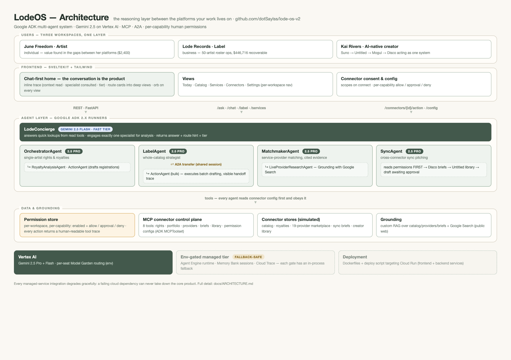

# LodeOS

> The agentic control plane for the music business - a Google ADK multi-agent system + SvelteKit.

LodeOS puts a team of Google ADK agents **across** an artist's disconnected platforms
(distribution, rights orgs, royalty collection, creation tools, sync marketplaces),
finds the **missing money** that falls through the gaps, and acts to recover it - under
human-set, per-capability permissions that genuinely gate what each agent may do.

---

## For judges - start here

**Live walkthrough & full demo script:** [docs/VALUE_PROPS.md](./docs/VALUE_PROPS.md)
(three personas, ~3-minute video walkthrough, pre-roll checklist).

### Architecture at a glance



Full architecture - agent team, A2A intents, connector permission model, grounding
sources, env gates, and the Cloud Run deployment mapping - is in
**[docs/ARCHITECTURE.md](./docs/ARCHITECTURE.md)**.

### Run it locally (2 terminals)

> ⚠️ **Never commit secrets.** Copy `.env.example` to `.env` and fill in your own
> credentials locally. `.gitignore` excludes `.env`, GCP service-account keys, and ADC files.

```bash
# 1) Backend  (http://localhost:8000)
python -m venv .venv && source .venv/bin/activate
pip install -r requirements.txt
uvicorn main:app --reload

# 2) Frontend (http://localhost:5173)
cd frontend
npm install
npm run dev
```

Then open **http://localhost:5173**. The home view is a chat with **Lode** - state intent
in plain language ("recover my unclaimed neighboring rights") and the agent team plans
and executes it. Switch between the three demo workspaces from the account button at the
bottom of the left rail.

**Google Cloud setup** (for Vertex AI / Cloud Run; the app also runs with an in-process
fallback if a managed service is unavailable):

```bash
gcloud init
gcloud services enable aiplatform.googleapis.com run.googleapis.com cloudbuild.googleapis.com firestore.googleapis.com
gcloud auth application-default login
# Deploy both containers to Cloud Run:
./deploy.sh
```

---

## Project description

### Problem to solve

An artist's catalog lives across half a dozen platforms - distribution, rights
organizations, royalty collection, creation tools, sync marketplaces - and money falls
through the gaps between them: unregistered neighboring rights, unclaimed mechanicals,
black-box royalties, unpitched sync opportunities. No single platform sees the whole
picture, so nobody is accountable for the gaps, and artists and labels leak revenue they
are legally owed.

### Our solution

LodeOS is an **agentic control plane** that puts a team of agents across an artist's (or a
whole label's) connected platforms. The agents:

- **Find missing money** - audit rights and royalties across connected sources and
  quantify what's recoverable.
- **Act to recover it** - draft ASCAP/BMI/SoundExchange registrations, propose bulk
  catalog remediation, and pitch the catalog into live sync-licensing briefs.
- **Match collaborators** - pair a song's needs (mix, master, art) with vetted service
  providers, citing concrete evidence for every match.
- **Stay on a leash you set** - every connector capability carries a human-set permission
  (*allow / needs approval / deny*) that agents read first and obey; actions return a
  visible tool trace so you can watch the settings being honored.

**The conversation is the product.** Quick lookups are answered by a fast Gemini 2.5 Flash
front line; complex cross-connector work is handed to Gemini 2.5 Pro specialists. Every
answer shows its work inline: which context was read (MCP connector tools), which
specialist was consulted (A2A hand-off), and which compute tier served it.

### Technologies used

| Layer | Tech |
|-------|------|
| Agents | **Google ADK 2.x** - 5 specialist graphs, agent-to-agent (**A2A**) delegation |
| Models | **Gemini 2.5 Pro + Flash** via **Vertex AI** (per-seat Model Garden overrides) |
| Grounding | Custom RAG over catalog/providers/briefs + **Grounding with Google Search** |
| Data access | **Model Context Protocol (MCP)** - Lode connector control plane (8 tools) |
| State | ADK Sessions (in-memory) → **Vertex Agent Engine** Sessions + Memory Bank (gated) |
| Observability | OpenTelemetry → **Cloud Trace** (gated) |
| Backend | Python · FastAPI |
| Frontend | SvelteKit · Tailwind CSS |
| Deployment | **Google Cloud Run** · **Cloud Build** (`./deploy.sh`); runs unchanged on GKE |

### Data sources

All demo data is synthetic (`data/mock_*.json`); no real artist PII is processed. The
mock JSON stores stand in for live platform APIs, accessed behind an MCP seam so they can
be swapped for live APIs with no agent changes:

- **Artist royalty context** (Mogul, over MCP via `mcp_server.py`; persona-scoped)
- **Label portfolio** - 50 artists with earnings, gaps, and a `sound` profile
- **Sync catalog** - a creator's Untitled library (playlists + tracks) or the label roster
- **Vetted provider marketplace** - 19 providers with rating/genre/rate evidence
- **Live sync briefs** - film/TV/ad/game/brand demand
- **Public web** - Grounding with Google Search (the built-in `google_search` tool)

### Findings and learnings

- **Permissions have to gate the model, not just the UI.** The honest version of "secure
  MCP" is that agents read a human-set config (`get_connector_config`) *at run time* as
  their first step - turning a capability off makes the agent decline and say why, not
  just hide a button.
- **One built-in tool, one isolation seam.** Vertex won't let the built-in `google_search`
  tool share a generate call with function tools, so live web research is isolated behind
  its own AgentTool (`LiveProviderResearchAgent`).
- **Two compute tiers beat one.** Routing quick lookups to Flash and reasoning to Pro
  specialists - and labeling which tier answered - keeps the chat fast without losing depth.
- **Graceful degradation as a design rule.** Every managed-service integration sits behind
  an env gate with a working in-process fallback, so a failure in any one cloud dependency
  never takes down the product.

### Third-party integrations

Connectors model real music-industry platforms (Mogul, Suno, Untitled, Disco, plus
available-to-connect: Samply, Spotify for Artists, DistroKid, ASCAP, SoundExchange,
Songtradr). In the demo these are **simulated** with synthetic data behind an MCP/OAuth-style
seam - no third-party APIs are called and no proprietary third-party data or content is
used. The seam is where each platform's real OAuth2/API-key exchange would land in
production. Google Cloud (ADK, Gemini on Vertex AI, Cloud Run, Cloud Build, Grounding with
Google Search) is used under its standard terms.

---

## What it does

- **Finds missing money** - audits an artist's (or a whole label roster's) rights and
  royalties across connected sources and quantifies what's recoverable.
- **Acts to recover it** - drafts ASCAP/BMI/SoundExchange registrations, proposes bulk
  catalog remediation, and pitches the catalog into live sync-licensing briefs.
- **Matches collaborators** - pairs a song's needs (mix, master, art) with vetted
  service providers, citing concrete evidence for every match.
- **Stays on a leash you set** - every connector capability carries a human-set
  permission (*allow / needs approval / deny*) that agents read first and obey; actions
  return a visible tool trace so you can watch the settings being honored.

When the full detail deserves a full page - the label's A2A trace, the matchmaker's
grounding evidence, a connector's permission gates - the chat offers a route card into
the deeper workspace views (Today, Catalog, Services, Connectors), where the floating
Lode orb keeps the conversation within reach.

## Who it's for

The demo ships three self-contained workspaces - switch between them from the
account button in the rail:

1. **June Freedom, independent artist** - *find the money you're owed.* Royalty gaps
   surfaced and registrations drafted (the $2,400 neighboring-rights moment on Today).
2. **Lode Records, label** - *operate the whole roster.* Catalog-wide audits across 50
   artists with bulk recovery delegated agent-to-agent (the visible LabelAgent →
   ActionAgent handoff on Catalog).
3. **Kai Rivers, AI-native creator** - *new revenue, on your terms.* Creates with
   Suno, keeps his library in Untitled, owns in Mogul, monetizes through Disco -
   and the connectors talk to each other: his dashboard shows the Untitled
   playlists, and one ask ("use Afterburn from my Sync Ready playlist") carries a
   track from the library into a drafted Disco pitch, under per-capability
   permissions he controls.

Each workspace scopes its own data, connectors, permissions, and agents. The three
journeys and a demo walkthrough are detailed in
[docs/VALUE_PROPS.md](./docs/VALUE_PROPS.md).

## Track 1 - Build (Net-New Agents): how LodeOS covers it

| Track 1 ask | Where it lives in LodeOS |
|-------------|--------------------------|
| **Net-new autonomous agent on ADK** | Five ADK graphs built from scratch: the LodeConcierge front line plus four Gemini 2.5 Pro specialists (royalty orchestrator, catalog strategist, service matchmaker, sync dealmaker) - `agents/*.py` |
| **From static code to declarative intent** | The chat-first home: the user states intent ("pitch my Sync Ready playlist into this week's briefs") and the concierge plans - gathers context with read tools, selects exactly one specialist, and answers from its result. No hard-coded flows. |
| **MCP to securely connect to external tools** | `mcp_server.py` - the Lode connector control plane exposes every platform (Mogul rights, Untitled library, Disco briefs, provider marketplace, connector registry) as MCP tools; agents consume it via ADK `MCPToolset` (`USE_MCP=true`). "Securely" is real: `get_connector_config` returns human-set *allow / needs-approval / deny* gates that agents must read before acting. |
| **Gather context** | Trace events surface every context-gathering step in the chat ("Read your royalty & library data", "Checked your connected platforms") - observable, not implied. |
| **Execute tasks autonomously** | Agents draft SoundExchange registrations, plan bulk catalog remediation, and submit sync pitches end-to-end within a turn - gated by the per-capability permissions on the Connectors page, with the A2A hand-off (LabelAgent → ActionAgent) visible in the trace. |

Every managed-service integration is env-gated with an in-process fallback, so the
product keeps working even if any single cloud dependency is unavailable.

## License

[MIT](./LICENSE) © 2026 Saylss
