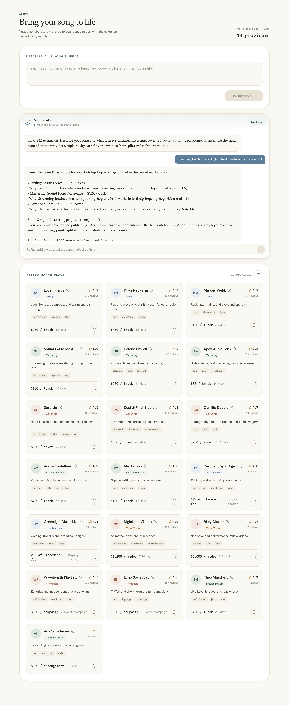

# Verification report

This template was booted and exercised end-to-end in **mock matchmaker mode**
(zero API keys, zero cloud). Every claim below was captured from a real run — it
is not aspirational. Reproduce it yourself with the commands in
[`SETUP.md`](./SETUP.md), or run the test suite (`cd backend && pytest`).

**Environment:** Python 3.11.2 · Node.js v24.11.1 · macOS (darwin) ·
`MATCHMAKER_MODE=mock`

---

## 1. Automated test suite — 13/13 passing

```
$ cd backend && pip install -r requirements.txt -r requirements-dev.txt && pytest
============================= test session starts ==============================
collected 13 items

tests/test_api.py::test_health_reports_mock_backend PASSED               [  7%]
tests/test_api.py::test_config_exposes_branding_and_categories PASSED    [ 15%]
tests/test_api.py::test_providers_endpoint_returns_the_marketplace PASSED [ 23%]
tests/test_api.py::test_every_provider_has_the_core_shape PASSED         [ 30%]
tests/test_api.py::test_provider_models_validate PASSED                  [ 38%]
tests/test_api.py::test_chat_assembles_a_grounded_team PASSED            [ 46%]
tests/test_api.py::test_chat_names_cited_providers_in_the_reply PASSED   [ 53%]
tests/test_api.py::test_chat_reports_rag_loaded_count PASSED             [ 61%]
tests/test_api.py::test_chat_remembers_the_running_brief_across_turns PASSED [ 69%]
tests/test_api.py::test_chat_without_a_need_greets_or_recaps PASSED      [ 76%]
tests/test_api.py::test_mode_resolution_mock PASSED                      [ 84%]
tests/test_api.py::test_mode_resolution_real_forced PASSED              [ 92%]
tests/test_api.py::test_mode_resolution_auto_needs_credentials PASSED   [100%]

======================== 13 passed in 0.42s ===================================
```

The suite drives the **real FastAPI app** (via `TestClient`) — the same code path
the running server uses — so a green run is direct evidence the API, the data
source, and the matchmaker all work.

## 2. Frontend typecheck — clean

```
$ cd frontend && npm run check
> svelte-kit sync && svelte-check --tsconfig ./tsconfig.json
COMPLETED 180 FILES 0 ERRORS 0 WARNINGS 0 FILES_WITH_PROBLEMS
```

## 3. Backend endpoints — live responses

**`GET /api/health`**
```json
{ "status": "ok", "matchmaker": "mock" }
```

**`GET /api/config`**
```json
{
  "name": "Sound Collective",
  "tagline": "Vetted collaborators matched to your song's needs.",
  "matchmaker_name": "Matchmaker",
  "categories": {
    "mixing": "Mixing", "mastering": "Mastering", "cover_art": "Cover Art",
    "vocal_production": "Vocal Production", "sync_licensing": "Sync Licensing",
    "music_video": "Music Video", "promotion": "Promotion",
    "session_musician": "Session Players"
  }
}
```

**`GET /api/providers`** → `200`, an array of **19** vetted providers. First row:
```json
{
  "id": "prov_mix_001", "name": "Logan Pierce", "category": "mixing",
  "specialty": "Lo-fi hip-hop, boom-bap, and warm analog mixing",
  "genres": ["lo-fi hip-hop", "hip-hop", "r&b", "soul"],
  "rating": 4.9, "reviews": 212, "turnaround": "3-5 days",
  "rate": "$350 / track", "location": "Brooklyn, NY", "verified": true
}
```

## 4. Grounded matchmaker chat — multi-turn, cited

**Turn 1** — `POST /api/chat` with
`"I need my lo-fi hip-hop single mixed, mastered, and cover art"`:

- `mode: mock` · `grounded: true` · `rag_loaded: 19` · `tool_calls: ["get_providers"]`
- **Cited providers** (every one is a real row from the marketplace, not invented):
  `Logan Pierce (mixing)`, `Sound Forge Mastering (mastering)`, `Sora Lin (cover_art)`
- Reply assembled a 3-member team with a *why* per match, a splits/rights
  proposal, and a **rough total of ~$770**.

**Turn 2** — `POST /api/chat` with `"now add a music video"` + the same
`session_id`:

- **Session persisted:** `true` (same `session_id` returned)
- Added `Nightloop Visuals (music_video)` — the brief accumulated across turns
  and kept the lo-fi hip-hop genre, exactly as a stateful agent should.

This is the grounding guarantee in action: the response only names providers that
exist in `data/providers.json`, and the `evidence.providers` chips let the UI
*prove* it.

## 5. Full stack in the browser — visual evidence

The SvelteKit frontend (http://localhost:5173) server-side-rendered the 19-provider
marketplace fetched from the backend, and the matchmaker chat returned the grounded
team live in the UI:



---

## How to reproduce

```bash
# Terminal 1 — backend (+ tests)
cd backend
python -m venv .venv && source .venv/bin/activate
pip install -r requirements.txt -r requirements-dev.txt
pytest                        # 13 passing
uvicorn main:app --reload     # serves http://localhost:8000

# Terminal 2 — frontend
cd frontend
npm install
npm run check                 # 0 errors
npm run dev                   # serves http://localhost:5173
```

Then open http://localhost:5173 and click **Find my team**.
